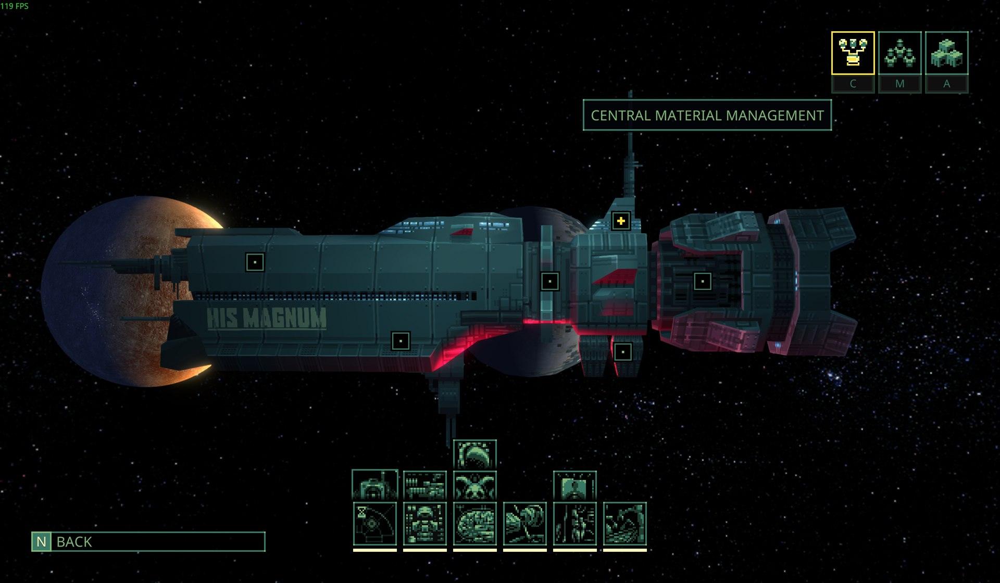

# Central Material Management / 中央物资管理

A Quasimorph mod that turns the Magnum's separate storage bays into one searchable logistics terminal — with agent loadout presets, vanilla augmentation installation, batch recycling, and a central-management-style station trade panel.

把飞船 1～7 号仓库、冷藏区和回收区整合成一个可搜索、可筛选、可排序、可直接配装与批量回收的中央终端；空间站贸易也换成中央管理风格的批量市场。

**Current version / 当前版本：1.6.1** · [Steam Workshop](https://steamcommunity.com/sharedfiles/filedetails/?id=3782793381)



---

## Download / 下载

| | |
| --- | --- |
| **Steam** | Subscribe on the [Steam Workshop](https://steamcommunity.com/sharedfiles/filedetails/?id=3782793381) — auto-updates. 直接订阅创意工坊，自动更新。 |
| **GOG / non-Steam** | Grab the zip from [Releases](../../releases/latest) and install it manually (below). GOG 等非 Steam 版本请到 Releases 下载 zip 手动安装。 |

## Manual install (GOG & non-Steam) / 手动安装

The mod folder lives outside the game directory, so the path is the same no matter where you bought the game.
mod 目录不在游戏安装目录里，所以无论从哪买的游戏，路径都一样。

1. Download `QM_CentralManagement_v1.6.1.zip` from [Releases](../../releases/latest).
2. Extract it. You should end up with a folder named exactly `QM_CentralManagement` containing `modmanifest.json`, `QM_CentralManagement.dll`, `config.txt` and `assets/`.
3. Move that folder into:

   ```
   C:\Users\<YourName>\AppData\LocalLow\Magnum Scriptum Ltd\Quasimorph\LocalUserPresets\
   ```

   Create `LocalUserPresets` yourself if it isn't there. (Paste `%USERPROFILE%\AppData\LocalLow\Magnum Scriptum Ltd\Quasimorph` into Explorer's address bar to get there.)
4. The result must look like this — the `.dll` sits directly inside a folder whose name matches the mod, **not** in a nested extra folder:

   ```
   LocalUserPresets\
     └─ QM_CentralManagement\
          ├─ modmanifest.json
          ├─ QM_CentralManagement.dll
          ├─ config.txt
          └─ assets\
   ```
5. Start the game. Research **Central Logistics Matrix** in the Supply tech tree, then press `C` on the spaceship screen.

**Updating**: close the game, replace the folder with the new one.
**Uninstalling**: delete the `QM_CentralManagement` folder. Loadout presets and settings are stored separately and are not lost.
**Do not** run the Workshop version and a manual copy at the same time — the game scans both locations and would load the mod twice.

中文：解压后得到名为 `QM_CentralManagement` 的文件夹，整个放进上面的 `LocalUserPresets\` 目录即可（没有该目录就自己新建）。注意 dll 要直接在这一层，别多套一层文件夹。更新就替换整个文件夹，卸载就删掉它。工坊版和手动版不要同时存在，否则会重复加载。

## Requirements / 环境要求

- Quasimorph 1.0 / 1.0.1 / 1.0.2
- No required dependencies — it loads through the game's official Mod/Hook system and uses the Harmony bundled with the game.
- Optional: [Crynano's Mod Configuration Menu](https://steamcommunity.com/workshop/browse/?appid=2059170) for in-game settings. Without it the mod reads `config.txt` and works fine.

## Configuration / 配置

Edit `config.txt` inside the mod folder. Full option list is in [README_EN.md](README_EN.md) / [README_CN.md](README_CN.md).

## Full documentation / 完整说明

- [README_EN.md](README_EN.md) — features, trade panel, tech tree cost, every config key
- [README_CN.md](README_CN.md) — 中文完整说明
- [workshop/](workshop/) — changelogs per version / 各版本更新日志

## Building from source / 从源码编译

```bash
dotnet build -c Release
```

Two things you need to point at yourself:

- `<GameManaged>` in [QM_CentralManagement.csproj](QM_CentralManagement.csproj) is an absolute path to your `Quasimorph_Data\Managed` folder — change it to yours.
- `libs/MCM.dll` (Mod Configuration Menu, by Crynano) is referenced at compile time but not redistributed here. Drop it into `libs/` from your Workshop subscription, or delete the `MCM` `<Reference>` and [McmIntegration.cs](McmIntegration.cs) if you don't need the settings-menu integration.

Output lands in `bin/Release/`. To package, copy the dll next to `modmanifest.json`, `config.txt` and `assets/`.

## License / 协议

[MIT](LICENSE) — 随便用、随便改，保留版权声明即可。The bundled game assets are not covered: `assets/` contains sprites derived from Quasimorph's own UI art, which belongs to Magnum Scriptum Ltd.

## Credits

- MCM integration builds on **Crynano's Mod Configuration Menu**.
- Thanks to the players who reported the ultrawide trade panel layout bug fixed in 1.5.1.
- 1.6.0: shuttle restock manifests were suggested by **Ashnal**; the mission-briefing
  entry, one-click repair (**Grokov**) and tech-level sorting (**Vatick**) all came
  from the Workshop comments.
- Thanks to **Joe** for asking for a non-Steam download — that is why this repo
  now carries releases.
- Global Currency compatibility was requested in the Workshop comments
  (Drakal and others).
